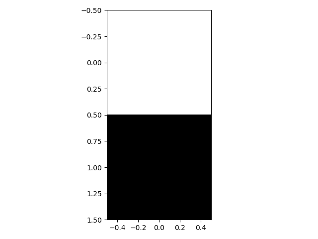

# image-restoration-traditionalway

> homework for ZJU: https://mo.zju.edu.cn/homework/zju_ai_2020_ss

# **习题3** - 图像恢复

## 3.1 **实验内容**

图像是一种非常常见的信息载体，但是在图像的获取、传输、存储的过程中可能由于各种原因使得图像受到噪声的影响——称为图像退化。图像复原就是重建退化的图像，使其最大限度恢复景物原貌的处理。如何去除噪声的影响，恢复图像原本的信息是计算机视觉中的重要研究问题。

常见的图像恢复算法有基于空间域的中值滤波、基于小波域的小波去噪、基于偏微分方程的非线性扩散滤波等，在本次实验中，:pushpin:**我们要对图像添加噪声，并对添加噪声的图像进行基于模型的去噪**。

## 3.2 **实验要求**

A. 生成受损图像。

- a) 受损图像是由原始图像添加了不同噪声遮罩（noise masks）得到的。
- b) 噪声遮罩仅包含 {0,1} 值。对原图的噪声遮罩的可以每行分别用 0.8/0.4/0.6 的噪声比率产生的，即噪声遮罩每个通道每行 80%/40%/60% 的像素值为 0，其他为 1。

B. 使用模型，进行图像恢复。

C. 评估误差为所有恢复图像与原始图像的 2-范数之和，此误差越小越好，其他评估方式包括 Cosine 相似度以及 SSIM 相似度。

D. 提交程序报告,请在本地编辑并命名为『程序报告.docx』或者 『程序报告.pdf』后， 上传到左侧文件列表中。

## 3.3 **实验环境**

可以使用基于Python的 [OpenCV](https://opencv-python-tutroals.readthedocs.io/en/latest/py_tutorials/py_tutorials.html) 库进行图像相关处理，使用 [Numpy](https://www.numpy.org/) 库进行相关数值运算。

## 3.4 **参考资料**

OpenCV：https://opencv-python-tutroals.readthedocs.io/en/latest/py_tutorials/py_tutorials.html

Numpy：https://www.numpy.org/


# notes

## 图像退化/复原过程模型


## 图像复原处理的过程

设原始图像 $f(x, y),$ 则退化后的图像可以表示为
$$
g(x, y)=H[f(x, y)]+\eta(x, y)
$$
其中 $H$ 为退化函数, $\eta(x, y)$ 为加性柬声, 复原的日标是得到基于退化图像的一个估计 $\hat{f}(x, y),$ 使得图像能够尽可能地贴近原始图像。 *若H是线性的、空间不变的过程, 则退化图像在空间频域中可以表示为
$$
g(x, y)=h(x, y) * f(x, y)+\eta(x, y)
$$
进行傅立叶变换, 有
$$
G(u, v)=H(u, v) F(u, v)+N(u, v)
$$

## **1. 图像增强与图像复原的区别**

图像增强的目的是消除噪声，显现那些被模糊了的细节或简单地突出一幅图像中读者感兴趣的特征，不考虑图像质量下降的原因。图像复原是**利用退化现象的某种先验知识**，建立退化现象的数学模型，再根据模型进行反向的推演运算，以恢复原来的景物图像。因而，图像复原可以理解为图像降质过程的反向过程。建立图像复原的反向过程的数学模型，就是图像复原的主要任务。经过反向过程的数学模型的运算，要想恢复全真的景物图像比较困难。所以， 图像复原本身往往需要有一个质量标准， 即衡量接近全真景物图像的程度，或者说，对原图像的估计是否到达最佳的程度。

## **2. 噪声模型：**

噪声主要来源于图像的获取和传输过程。

（1）图像传感器的工作情况受各种因素的影响，如图像获取中的环境条件和传感器元器件自身的质量。

（2）图像在传输过程中主要由于所用传输信道被干扰而受到噪声污染。

**噪声种类：**高斯噪声、瑞利噪声、伽马噪声、指数噪声、均匀分布噪声、脉冲噪声（椒盐噪声）


```matlab
x=-4:.1:4;
subplot(321)
Y1=show_noise_pdf('gaussian',x,0,1);
plot(x,Y1);
title('高斯');
subplot(322)
Y2=show_noise_pdf('uniform',x,-3,3);
plot(x,Y2);
title('均匀');
subplot(323)
Y3=show_noise_pdf('salt & pepper',x);
plot(x,Y3);
title('椒盐');
subplot(324)
Y4=show_noise_pdf('rayleigh',x,1);
plot(x,Y4);
title('瑞利');
subplot(325)
Y5=show_noise_pdf('exp',x,1);
plot(x,Y5);
title('指数');
subplot(326)
Y6=show_noise_pdf('gamma',x,2,5);
plot(x,Y6);
title('伽马');

```


### 噪声概率密度函数probability density function：

#### 高斯噪声

概率密度函数：$p(z)=\frac{1}{\sqrt{2πσ}}e^{−\frac{(z−μ)^2}{2σ^2}}$
均值：$μ$
方差：$σ^2$

高斯噪声是一个均值为 0 方差为 $σ_n^2  $的正态分布，是一个加性噪声（在原图的基础上加上噪声即为加噪后的图象）。但要正确地给图片添加高斯噪声，还要取决于程序中读入图片的数据格式。

#### 瑞利噪声 

$$
\begin{aligned}
&\text { 概率密度函数： }\\
&p(z)=\left\{\begin{array}{ll}
\frac{2}{b}(z-a) e^{-(z-a)^{2} / b}, & z \geq a \\
0, & z<a
\end{array}\right.\\
&\text { 均值： } \mu=a+\sqrt{\pi b} / 4\\
&\text { 方差: } \sigma^{2}=\frac{b(4-\pi)}{4}
\end{aligned}
$$

曲线：

#### 伽马（爱尔兰）噪声 

$$
\begin{aligned}
&\text { 概率密度函数： }\\
&p(z)=\left\{\begin{array}{ll}
\frac{a^{b} z^{(b-1)}}{(b-1) !} e^{-a z}, & z \geq 0 \\
0, & z<0
\end{array}\right.\\
&\text { 均值： } \mu=\frac{b}{a}\\
&\text { 方差： } \sigma^{2}=\frac{b}{a^{2}}
\end{aligned}
$$

曲线： 
注意：只有当分母是Γ(b)Γ(b)时，才是伽马噪声，如表达式中的，该密度近似称为爱尔兰密度 

#### 指数分布噪声 

$$
\begin{aligned}
&\text { 概率密度函数： }\\
&p(z)=\left\{\begin{array}{ll}
a e^{-a z}, & z \geq 0 \\
0, & z<0
\end{array}\right.\\
&\text { 均值: } \mu=\frac{1}{a}\\
&\text { 方差： } \sigma^{2}=\frac{1}{a^{2}}
\end{aligned}
$$

#### 脉冲（椒盐）噪声 

概率密度函数： 双极脉冲口声 $p(z)=\left\{\begin{array}{ll}P_{a}, & z=a \\ P_{b}, & z=b \\ 0, & \text { 其他 }\end{array}\right.$
如果b>a，灰度值b在图像中将显示为一个亮点，相反，a的值将显示为一个暗点。若Pa或Pb为零，则脉冲噪声为单极脉冲。如果两者都不为零，尤其在它们近似相等时，脉冲噪声将类似于随机分布在图像上的胡椒和盐粉微粒，因此双极脉冲噪声也称为椒盐噪声。 


## **3. 空间滤波**

> 图像滤波器又叫做**掩模**、**核**、**模板**或**窗口**，是与原图像的子图像有相同维数的子图像，滤波器子图像中的值是**系数值**，不是像素值，滤波器的处理结果是子图像中心位置像素值等于被掩住位置的像素值与滤波器中系数的**点积和**。

<u>无论是平均平滑还是高斯平滑，在处理图像噪声时，都或多或少会对图片产生一定的模糊</u>，损失部分信息。较为理想的情况，是可以选择性地进行滤波，只在噪声区域进行平滑，而在无噪声区域不进行平滑，将模糊的影响降到最低，这就是自适应性滤波的思想。通常噪声的存在，可能会使得附近邻域内，极值的上下差距较大，或者是方差较大，我们可以设置一定的阈值来判断该点是否需要进行平滑。不过这个不是该章节的内容。

​    不同的滤波器在处理不同类型的噪声是效果不同，对于线性平滑滤波，在处理像素邻域内的噪声点时，噪声或多或少都会影响该点的像素值计算(以高斯平滑为例，距离近则影响大，距离远则影响小，与距离的平方呈反比)；但是中值滤波通常可以将噪声点直接忽略掉。同时，中值滤波在降噪的同时引起的模糊效应较低。中值滤波的一种典型应用，就是用来消除椒盐(salt & pepper)噪声。

---

**空间滤波器种类：**均值滤波器（适于高斯噪声）、统计排序滤波器（适于椒盐噪声）、自适应局部噪声消除滤波器（适于所有噪声）、自适应中值滤波器（适于椒盐噪声）。

空域滤波器分为**平滑滤波器**和**锐化滤波器**，平滑滤波用**积分**实现，锐化滤波用**微分**实现

- 平滑滤波器（低通滤波器）：------体现一种平均，所以模板均下来一般为1

  - 作用：***\*模糊处理\****:去除图像中一些不重要的细节、减小噪声

  - 分类：

    1.**线性滤波器**：均值滤波器

    2.**非线性滤波器**（一般指统计排序滤波器）： 中值滤波器

- **锐化滤波（高通滤波器）****-----**体现一种插值，所以模板均下来是0

  - 作用：1.提取图像的边缘信息、2.突出图像边缘及细节、3.拟补平滑滤波造成的边缘模糊

### 3.1 均值滤波器——均值滤波器

- 算术均值滤波器 描述: $\hat{f}(x, y)=\sum_{(s, t) \in S_{x y}} g(s, t)$
  结果：模糊了结果, 降低了口声
  适用：适用于高斯口声或均匀随机噪声

- 几何均值滤波器 描述: $\hat{f}(x, y)=\left[\prod_{(s, t) \in S_{x y}} g(s, t)\right]$
  结果：和算术均值滤波器相比, 丟失更少的细节 
  适用：同算术均值滤波器

- 谐波均值滤波器 描述: $\hat{f}(x, y)=\frac{m n}{\sum_{(z, y) \in S_{z y}} \frac{1}{g(s, t)}}$

  结果：谐波均值滤波器对于“盐”噪声效果更好，但是不适用于“胡椒”噪声。 
  适用：像高斯那样的噪声

- 逆谐波均值滤波器 
  其实Q称为滤波器的阶数，当Q值为正时，滤波器用于消除“胡椒”噪声；当Q值为负时，滤波器用于消除“盐”噪声。但它不能同时消除两种噪声，当Q值为0时，逆谐波滤波器变为算术均值滤波器；当Q为-1时，逆谐波均值滤波器退变为谐波均值滤波器。 
  适用：脉冲噪声 
  缺点：必须知道是明噪声还是暗噪声

- 高斯滤波

  GaussianBlur， k窗口值都是奇数，如3、5、7，越靠近中心的权重越大。整个高斯核跟图像窗口做卷积后取其值

### 3.2 顺序统计滤波器——非线性滤波器

- 中值滤波器 
  描述: $\hat{f}(x, y)=\operatorname{median}_{(s, t) \in S_{x y}\{g(s, t)\}}$，中值滤波本质上是一个**统计排序滤波器**，是以该点为中心的的邻域内的所有像素的统计排序中值作为该点的响应；而平滑就是加权平均数作为响应，概念上有一定差别。
  适用：对单极或双极脉冲噪声非常有效

  视频讲解：https://www.bilibili.com/video/BV1fQ4y1N7EP?from=search&seid=11848827709822211739

- 最大值滤波器 描述: $\hat{f}(x, y)=\max _{(s, t) \in S_{z y}}\{g(s, t)\}$
  结果:
  适用：发现图像中的最亮点，故适用于去除“胡椒”噪声（黑色）

- 最小值滤波器 描述: $\hat{f}(x, y)=\min _{(s, t) \in S_{x y}}\{g(s, t)\}$
  适用: 发现图像中的最暗点，适用于去除“盐”噪声（白色）

- 中点滤波器 描述: $\hat{f}(x, y)=\left[\max _{(s, t) \in S_{x y}}\{g(s, t)\}+\min _{(s, t) \in S_{x y}}\{g(s, t)\}\right]$
  适用: 结合了顺序统计和求平均，对高斯和均匀随机分布的噪声有很好的效果

- 修正后的阿尔法均值滤波體 描述: $\hat{f}(x, y)=\frac{1}{m n} \sum_{(s, t) \in S_{x y}}\left\{g_{r}(s, t)\right\}$
  在$S_{xy}$邻域内取点g（s，t）最高灰度值的d/2和最低灰度值的d/2，用gr(s,t)来代表剩余的mn-d个像素，由这些剩余像素点的平均值形成的滤波器称为修正后的阿尔法均值滤波器 
  当d=0时，退变为算术均值滤波器；当d=（mn-d）/2时，退变为中值滤波器。 
  适用：对多重混合的噪声有很好的效果

### 3.3 自适应滤波器

自适应滤波器的行为变化基于由m*n矩形窗口Sxy定义的区域内图像的统计特性，它的性能要明显优于前面介绍的滤波器，代价是滤波器的复杂度。

- 自适应、局部噪声消除滤波器 
  描述: $\hat{f}(x, y)=g(x, y)-\frac{\sigma_{\eta}^{2}}{\sigma_{L}^{2}}\left[g(x, y)-m_{L}\right]$
  其中 $\sigma_{\eta}^{2}, g(x, y)$ 形成的噪声方差
  $m_{L},$ 局部像素点的均值 
  $\sigma_{L}^{2},$ 局部方差 
  滤波器性能预期：
  (1) 如果 $\sigma_{\eta}^{2}$ 为零, 滤波器应该简单的返回 $g(x, y)$ 的值。
  (2) 如果局部方差与 $\sigma_{\eta}^{2}$ 是高度相关的, 那么滤波器要返回一个 $g(x, y)$ 的近似值。
  (3) 如果两个方差相等, 希望滤波器返回区域Sxy上像素的算术均值。 个关键的问题是 $\sigma_{\eta}^{2}$ 未知, 需要进行估计，合理的估计会带来较好的滤波效果。 适用：防止由于缺乏图像噪声方差知识而产生的无意义结果, 适用均值和方差确定的加性高斯口声。

- 自适应中值滤波器 
  描述：自适应中值滤波算法分两层进行 
  先考虑如下符号：
  - Zmin=Sxy中灰度值的最小值 
  - Zmax=Sxy中灰度值的最大值 
  - Zmed=Sxy中灰度值的中间值 
  - Zxy=在坐标（x，y）上的灰度值 
  - Smax=Sxy允许的最大尺寸 
    算法流程： 
    A层： A1=Zmed-Zmin； 
    A2=Zmed-Zmax； 
    如果A1>0且A2<0（即Zmin

from: https://blog.csdn.net/xdmdth/article/details/46889091?utm_medium=distribute.pc_relevant.none-task-blog-BlogCommendFromBaidu-3.control&depth_1-utm_source=distribute.pc_relevant.none-task-blog-BlogCommendFromBaidu-3.control


# Mycode

## 增加噪声

### 椒盐噪声

```python
class NoiseGenerator:
    @staticmethod
    def add_pulse_noise(im, noise_ratios=0.3):
        """
        给图像增加脉冲噪声
        脉冲噪声：噪声点只有两种情况，全黑or全白，因此又称为椒盐噪声
        :param im: 待处理的图像
        :param noise_ratios: 噪声比
        :return:
        """
        h, w = im.shape[0:2]                            # 获得图像的长宽
        p_size = h * w                                  # 计算出图像的平面大小
        for r in range(int(p_size * noise_ratios)):     # 噪声点数量
            # 获得噪声的随机位置
            rand_h = random.randint(0, h - 1)
            rand_w = random.randint(0, w - 1)
            # 两种处理: 1.像素点设置为全黑，2.像素点设置为全白
            im[rand_h, rand_w, :] = np.array([0, 0, 0]) if random.random() < 0.5 else np.array([255, 255, 255])
        return im
```

### 高斯噪声

```python
class NoiseGenerator:
    @classmethod
    def _normalization(cls, image):
        """
        将数据线性归一化
        :param image: 图片矩阵，一般是np.array 类型
        :return: 将归一化后的数据，在（0,1）之间
        """
        # 获取图片数据类型对象的最大值和最小值
        info = np.iinfo(image.dtype)
        # 图像数组数据放缩在 0-1 之间
        return image.astype(np.double) / info.max
    
    @staticmethod
    def add_gaussian_noise(im, mean=0, var=0.005):
        """
        添加高斯噪声
        :param im:
        :param mean: 均值
        :param var: 方差
        :return:
        """
        # image = np.array(im / 255, dtype=float)   # 将像素值归一， (0, 1)
        image = NoiseGenerator._normalization(im)   # 将像素值归一, (0, 1)
        noise = np.random.normal(mean, var ** 0.5, image.shape)  # 产生高斯噪声
        noised_im = image + noise  # 直接将归一化的图片与噪声相加
        def clip_img(noised_im):
            """
            将值限制在(-1或0, 1)间，然后乘255恢复
            :param noised_im: 加了噪声的图片
            :return: clip过的图片
            """""
            low_clip = -1. if noised_im.min() < 0 else 0. # 如果最小值小于1, 则边界设为(-1, 1)
            out_im = np.clip(noised_im, low_clip, 1.0)	  # 如果noised_im中像素小于low_clip则置为low_clip, 大于1值置为1
            out_im = np.uint8(out_im * 255)				 # 将(-1, 1)的浮点型转成(0, 255)的整型
            return out_im
        return clip_img(noised_im)
```

▲这边肯定有人会好奇`out_im = np.uint8(out_im * 255)`并不是将其转换到(0, 255)，而是(-255, 255)。 解释一下：——注意这边的`np.uint8`可以看到这边的数据类型就是8位int，所以范围是0-255，因此即使num=-55，那么计算的结果其实是201； num=-1，结果其实是255。

法二：skimage

```python
from matplotlib import pyplot as plt
from skimage import io
import skimage
import pylab
impath = "000001.jpg"
image = io.imread(impath)
img1 = image / 255.00		# 均一化处理
img2 = skimage.util.random_noise(image,mode='gaussian',seed=None,clip=True)
plt.figure(1)
plt.subplot(121)
plt.imshow(img1)
plt.title("Origin picture")
plt.subplot(122)
plt.imshow(img2)
plt.title("Add Gaussian noise")
pylab.show()
plt.savefig("noise_image.jpg")
```

注意到：增加高斯噪声还可以用图像三方库完成的：`skimage.util.random_noise(image,mode ='gaussian',seed=None,clip=True)`

### skimage的简介

> skimage即是Scikit-Image。基于python脚本语言开发的数字图片处理包，比如PIL,Pillow, opencv, scikit-image等。
>
> PIL和Pillow只提供最基础的数字图像处理，功能有限；opencv实际上是一个c++库，只是提供了python接口，更新速度非常慢。scikit-image是基于**scipy**的一款图像处理包，它将图片作为numpy数组进行处理，正好与matlab一样，因此，我们最终选择scikit-image进行数字图像处理。
>
> skimage包的全称是scikit-image SciKit (toolkit for SciPy) ，它对scipy.ndimage进行了扩展，提供了更多的图片处理功能。它是由python语言编写的，由scipy 社区开发和维护。skimage包由许多的子模块组成，各个子模块提供不同的功能。

| 子模块名称   |                        主要实现功能                         |
| ------------ | :---------------------------------------------------------: |
| io           |                 读取、保存和显示图片或视频                  |
| data         |                 提供一些测试图片和样本数据                  |
| color        |                        颜色空间变换                         |
| filters      |         图像增强、边缘检测、排序滤波器、自动阈值等          |
| draw         | 操作于numpy数组上的基本图形绘制，包括线条、矩形、圆和文本等 |
| transform    |        几何变换或其它变换，如旋转、拉伸和拉东变换等         |
| morphology   |             形态学操作，如开闭运算、骨架提取等              |
| exposure     |           图片强度调整，如亮度调整、直方图均衡等            |
| feature      |                      特征检测与提取等                       |
| measure      |             图像属性的测量，如相似性或等高线等              |
| segmentation |                          图像分割                           |
| restoration  |                          图像恢复                           |
| util         |                          通用函数                           |

### 数据加模糊——高斯模糊：

- 本质上是低通滤波器，输出图像的每个像素点是原图像上对应像素点与周围像素点的加权和。
- 即用高斯分布权值矩阵与原始图像矩阵做卷积运算。

[https://blog.csdn.net/qq_37995260/article/details/100351153](python代码学习-数据处理图片加遮挡、噪声、模糊)

[Python给图像添加噪声具体操作](http://www.cppcns.com/jiaoben/python/253632.html)


## 增加噪声noise_mask_image

```python
def noise_mask_image(img, noise_ratio):
    """
    根据题目要求生成受损图片
    :param img: 图像矩阵，一般为 np.ndarray
    :param noise_ratio: 噪声比率，可能值是0.4/0.6/0.8
    :return: noise_img 受损图片, 图像矩阵值 0-1 之间，数据类型为 np.array,
             数据类型对象 (dtype): np.double, 图像形状:(height,width,channel),通道(channel) 顺序为RGB
    """
    # 受损图片初始化
    noise_img = None

    # -------------实现受损图像答题区域-----------------
    h, w = img.shape[:2]        # h为图片的长, w为图片的宽
    noise_img = NoiseGenerator._normalization(img)

    for dh in range(h):
        mask_indexes = random.sample(range(w), int(w*noise_ratio))
        for c in range(w):
            if c in mask_indexes:
                noise_img[dh, c, :] = 0
    # -----------------------------------------------
    return noise_img

# 符合题意版本
def noise_mask_image(img, noise_ratio):
    """
    根据题目要求生成受损图片
    :param img: 图像矩阵，一般为 np.ndarray
    :param noise_ratio: 噪声比率，可能值是0.4/0.6/0.8
    :return: noise_img 受损图片, 图像矩阵值 0-1 之间，数据类型为 np.array, 
             数据类型对象 (dtype): np.double, 图像形状:(height,width,channel),通道(channel) 顺序为RGB
    """
    # 受损图片初始化
    noise_img = None

    # -------------实现受损图像答题区域-----------------
    import random
    from copy import deepcopy
    noise_img = deepcopy(img)
    h, w = img.shape[: 2]  # h为图片的长, w为图片的宽
#     noise_img = normalization(img)
    for dh in range(h):  # 遍历每行
        cols = range(w)
        mask_indexes = random.sample(cols, int(w * noise_ratio))
        pixel_list = [0 if i in mask_indexes else 1 for i in cols]
        for c in cols:
            noise_img[dh, c, :] = noise_img[dh, c, :] * pixel_list[c]
    # -----------------------------------------------
    noise_img = np.array(noise_img, dtype='double')
    return noise_img
```

[Python的random操作](https://www.cnblogs.com/qi-yuan-008/p/12581979.html)

## 图像恢复

### 中值滤波demo

```python
from PIL import Image
import numpy as np

def AddNoise(src, dst, probility=0.05):
    """
    salt_pepper增加噪声
    :param src:
    :param dst:
    :param probility:
    :return:
    """
    imarray = np.array(Image.open(src))
    height, width = imarray.shape[:2]
    for i in range(height):
        for j in range(width):
            if np.random.random(1) < probility:
                if np.random.random(1) < 0.5:
                    imarray[i, j, :] = 0
                else:
                    imarray[i, j, :] = 255
    new_im = Image.fromarray(imarray)
    new_im.save(dst)


def MedianFilter(src, dst, k=3, padding=None):
    """
    中值滤波
    :param src:
    :param dst:
    :param k: 过滤器核大小
    :param padding:
    :return:
    """
    imarray = np.array(Image.open(src))
    height, width, channels = imarray.shape

    if not padding:
        edge = int((k - 1) / 2)
        if height - 1 - edge <= edge or width - 1 - edge <= edge:
            print("The parameter k is to large.")
            return None
        new_arr = np.zeros((height, width, 3), dtype="uint8")
        for i in range(height):
            for j in range(width):
                for c in range(channels):           # 处理3个通道
                    if i <= edge - 1 or i >= height - 1 - edge or j <= edge - 1 or j >= width - edge - 1:
                        new_arr[i, j, c] = imarray[i, j, c]
                    else:
                        new_arr[i, j, c] = np.median(imarray[i - edge:i + edge + 1, j - edge:j + edge + 1, c])
        new_im = Image.fromarray(new_arr)
        new_im.save(dst)


if __name__ == '__main__':
    gray_girl = "A.png"
    tar = "A_noised.png"
    AddNoise(gray_girl, tar)
    src = "A_noised.png"
    dst = "A_repaired.png"
    MedianFilter(src, dst)
```

下图是k=3是的改进后的中值滤波策略的结果，可以看到图像的清晰度得到了较大的保留，噪声的数量就相对也残留的比较多。从中可以看到，二者之间有此消彼长的关系。至于为什么还有这么多的椒盐噪声，原因是因为我们添加噪声的代码中设置的概率太高了，导致图像中的椒盐噪声数量非常多，<u>在小区域内有可能有许多的噪声点，导致算法所寻找到的中值仍然是噪声的数值范围</u>。这种情况下扩大滤波模板的大小并不会有多大的改变。此时可以将已经执行过一次中值滤波的结果图像再执行一次中值滤波，效果就会更好一些。

参考：数字图像处理的python实现(8)——中值滤波https://blog.csdn.net/baidu_41902768/article/details/94451787——上述代码在j的条件判断上需要将height-1-edge改成width-1-edge


### 图像修复restore_image

```python
class Filter:
    def __init__(self, k = 3):
        self.k = k
        self.padding = None

    def get_median(self, imarray):
        """
        中值滤波
        :param imarray:
        :return:
        """
        height, width, channels = imarray.shape
        if not self.padding:
            edge = int((self.k - 1) / 2)
            if height - 1 - edge <= edge or width - 1 - edge <= edge:
                print("The parameter k is to large.")
                return None
            new_arr = np.zeros((height, width, 3), dtype="uint8")
            for i in range(height):
                for j in range(width):
                    for c in range(channels):  # 处理3个通道
                        if i <= edge - 1 or i >= height - 1 - edge \
                                or j <= edge - 1 or j >= width - edge - 1:
                            # 除了中心点以外其他边沿的点
                            new_arr[i, j, c] = imarray[i, j, c]
                        else:
                            # 中心点为排序后的中值
                            new_arr[i, j, c] = np.median(imarray[i-edge: i+edge+1, j-edge: j+edge+1, c])

            return new_arr

    def get_max(self, imarray):
        """
        中值滤波
        :param imarray:
        :return:
        """
        height, width, channels = imarray.shape
        if not self.padding:
            edge = int((self.k - 1) / 2)
            if height - 1 - edge <= edge or width - 1 - edge <= edge:
                print("The parameter k is to large.")
                return None
            new_arr = np.zeros((height, width, 3), dtype="uint8")

            for i in range(height):
                for j in range(width):
                    for c in range(channels):  # 处理3个通道
                        if i <= edge - 1 or i >= height - 1 - edge \
                                or j <= edge - 1 or j >= width - edge - 1:
                            # 边界处理， 当i索引<=edge-1 -> 或者 i >= ((height-1)->图像边界-edge)->窗口在图像边界内的边界
                            new_arr[i, j, c] = imarray[i, j, c]
                        else:
                            # 中心点为排序后的中值
                            new_arr[i, j, c] = np.max(imarray[i-edge: i+edge+1, j-edge: j+edge+1, c])
            return new_arr


def restore_image(noise_img, size=4):
    """
    使用 你最擅长的算法模型 进行图像恢复。
    :param noise_img: 一个受损的图像
    :param size: 输入区域半径，长宽是以 size*size 方形区域获取区域, 默认是 4
    :return: res_img 恢复后的图片，图像矩阵值 0-1 之间，数据类型为 np.array,
            数据类型对象 (dtype): np.double, 图像形状:(height,width,channel), 通道(channel) 顺序为RGB
    """
    # 恢复图片初始化，首先 copy 受损图片，然后预测噪声点的坐标后作为返回值。
    res_img = np.copy(noise_img)

    # 获取噪声图像
    noise_mask = get_noise_mask(noise_img)

    # -------------实现图像恢复代码答题区域----------------------------


    # ---------------------------------------------------------------

    return res_img
```

目前修复思路: 由于观察到mask基本都是胡椒噪声（黑色），因此最大值滤波效果会比较好一点，但是仍然会有少量椒盐噪声残余，因此，可以采用将降噪后的图像再次降噪（而不是扩大过滤核大小）。 在这里剩余的仍然是胡椒噪声（黑色），但是经过测试可以看出最大值滤波对图像的影响明显大于中值滤波，最大值滤波会比较模糊，因此这边采用的是“最大值滤波+中值滤波”的组合。（注：为什么先用最大值滤波？因为实验测试第一次就用中值滤波效果很差）


#### 先用最大值滤波的效果：


##### 组合中值滤波的效果：


##### 组合最大值滤波效果


直接使用中值滤波实验结果：


#### 记录坑点：

> 用savefig保存时，图片会有压缩，导致保存和重新从文件中读取的内容有些区别

```python
    noised_im = NoiseGenerator.add_pulse_noise(im)	# (1104, 828, 3)
    plt.imshow(noised_im)
    plt.axis("off")
    plt.savefig("A_noised.png")
    src = "A_noised.png"
    dst = "A_repaired.png"
    MedianFilter(src, dst)							# (480, 640, 4)
```


### 总结：

> samples给的图中噪声基本都是胡椒噪声，没有什么盐噪声，因此考虑最大值滤波

- 当黑色占比大于0.3时使用"最大值滤波+中值滤波组合"， 当小于0.3时直接使用中值滤波
- k=5太模糊，目前使用k=3

# 附录

- [图像复原原理及实现](https://blog.csdn.net/u012526003/article/details/77784211/?utm_medium=distribute.pc_relevant.none-task-blog-title-3&spm=1001.2101.3001.4242)

## 读取展示图片的两种方式：

```python
# -----------------用cv的imshow-------------
def add_noise(filename):
    im = cv2.imread(filename)
    cv2.imshow('original img', im)
    h, w = im.shape[0:2]
    pNum = h * w
    nRate = 0.3
    for r in range(int(pNum * nRate)):
        randh = random.randint(0, h - 1)
        randw = random.randint(0, w - 1)
        # print(h,randh,w,randw)
        if random.random() < 0.5:
            im[randh, randw, :] = np.array([0, 0, 0])
        else:
            im[randh, randw, :] = np.array([255, 255, 255])
    cv2.imshow('add noise', im)
    cv2.waitKey(0)
add_noise('A.png')

#-----------------用plt.imshow-------------
def show_photo(pic_path):
    """
    :param pic_path: 图片路径
    :return: <class 'numpy.ndarray'>
    """
    # 以 BGR 方式读取图片
    im = cv2.imread(pic_path)
    # 将 BGR 方式转换为 RGB 方式
    im = cv2.cvtColor(im, cv2.COLOR_BGR2RGB)
    # 展示图片
    plt.imshow(im)
    # 关闭坐标轴
    plt.axis('off')
    # show
    plt.show()
    return im
```


## imshow的参数

```python
	@_preprocess_data(label_namer=None)
    def imshow(self, X, cmap=None, norm=None, aspect=None,
               interpolation=None, alpha=None, vmin=None, vmax=None,
               origin=None, extent=None, shape=None, filternorm=1,
               filterrad=4.0, imlim=None, resample=None, url=None, **kwargs):
        """
        Display an image on the axes.

        Parameters
        ----------
        X : array_like, shape (n, m) or (n, m, 3) or (n, m, 4)
            Display the image in `X` to current axes.  `X` may be an
            array or a PIL image. If `X` is an array, it
            can have the following shapes and types:

            - MxN -- values to be mapped (float or int)
            - MxNx3 -- RGB (float or uint8)
            - MxNx4 -- RGBA (float or uint8)

            MxN arrays are mapped to colors based on the `norm` (mapping
            scalar to scalar) and the `cmap` (mapping the normed scalar to
            a color).

            Elements of RGB and RGBA arrays represent pixels of an MxN image.
            All values should be in the range [0 .. 1] for floats or
            [0 .. 255] for integers.  Out-of-range values will be clipped to
            these bounds.
```

### clip

```
# Clipping input data to the valid range for imshow with RGB data ([0..1] for floats or [0..255] for integers).
```

按照上述信息可知，如果元素为float类型且超过了1，则会被clip，这边clip就是上下限幅，而不是截取小数点后部分

```python
    res = np.array([
        [[1.22,2.22,3.22]],
        [[-0.55,-0.44,-6.55]]
    ]
```



